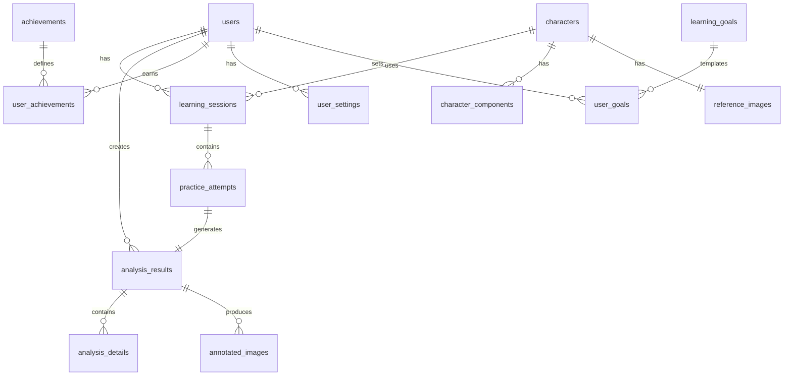

# 🗄️ 데이터베이스 설계 문서 (ERD)
## Database Design Document

### 프로젝트명: 서예마스터 (Calligraphy Master)
### 버전: 1.0
### 작성일: 2025-08-14

---

## 1. 데이터베이스 개요

### 1.1 데이터베이스 선택
- **Primary DB**: PostgreSQL 14+
  - 관계형 데이터, 트랜잭션 처리
  - JSON/JSONB 지원으로 유연한 스키마
- **Cache DB**: Redis 7+
  - 세션 관리, 임시 데이터
  - 실시간 리더보드
- **File Storage**: AWS S3 / Firebase Storage
  - 이미지 파일 저장
  - CDN 연동

### 1.2 명명 규칙
- 테이블명: 복수형, snake_case (예: `users`, `analysis_results`)
- 컬럼명: snake_case (예: `user_id`, `created_at`)
- 인덱스: `idx_테이블명_컬럼명` (예: `idx_users_email`)
- 외래키: `fk_테이블명_참조테이블명` (예: `fk_attempts_users`)

---

## 2. Entity Relationship Diagram



---

## 3. 테이블 명세

### 3.1 사용자 관련 테이블

#### users (사용자)
```sql
CREATE TABLE users (
    id UUID PRIMARY KEY DEFAULT gen_random_uuid(),
    email VARCHAR(255) UNIQUE NOT NULL,
    password_hash VARCHAR(255) NOT NULL,
    nickname VARCHAR(50) NOT NULL,
    birth_year INTEGER,
    learning_level VARCHAR(20) DEFAULT 'beginner',
    profile_image_url TEXT,
    total_practice_time INTEGER DEFAULT 0,
    total_characters_learned INTEGER DEFAULT 0,
    current_streak INTEGER DEFAULT 0,
    longest_streak INTEGER DEFAULT 0,
    experience_points INTEGER DEFAULT 0,
    level INTEGER DEFAULT 1,
    is_active BOOLEAN DEFAULT true,
    email_verified BOOLEAN DEFAULT false,
    last_login_at TIMESTAMP,
    created_at TIMESTAMP DEFAULT CURRENT_TIMESTAMP,
    updated_at TIMESTAMP DEFAULT CURRENT_TIMESTAMP,
    
    CONSTRAINT chk_learning_level CHECK (learning_level IN ('beginner', 'intermediate', 'advanced')),
    CONSTRAINT chk_birth_year CHECK (birth_year >= 1900 AND birth_year <= EXTRACT(YEAR FROM CURRENT_DATE))
);

CREATE INDEX idx_users_email ON users(email);
CREATE INDEX idx_users_level ON users(level);
```

#### user_settings (사용자 설정)
```sql
CREATE TABLE user_settings (
    user_id UUID PRIMARY KEY REFERENCES users(id) ON DELETE CASCADE,
    theme VARCHAR(20) DEFAULT 'light',
    language VARCHAR(10) DEFAULT 'ko',
    notification_enabled BOOLEAN DEFAULT true,
    daily_reminder_time TIME,
    weekly_goal INTEGER DEFAULT 5,
    auto_save BOOLEAN DEFAULT true,
    show_guidelines BOOLEAN DEFAULT true,
    haptic_feedback BOOLEAN DEFAULT true,
    sound_effects BOOLEAN DEFAULT true,
    privacy_mode BOOLEAN DEFAULT false,
    created_at TIMESTAMP DEFAULT CURRENT_TIMESTAMP,
    updated_at TIMESTAMP DEFAULT CURRENT_TIMESTAMP,
    
    CONSTRAINT chk_theme CHECK (theme IN ('light', 'dark', 'auto')),
    CONSTRAINT chk_language CHECK (language IN ('ko', 'en', 'zh', 'ja'))
);
```

### 3.2 한자 관련 테이블

#### characters (한자 정보)
```sql
CREATE TABLE characters (
    id VARCHAR(10) PRIMARY KEY,  -- Unicode 코드
    character_symbol VARCHAR(5) NOT NULL,  -- 실제 한자
    pinyin VARCHAR(50),  -- 중국어 발음
    korean_reading VARCHAR(50),  -- 한국 음훈
    meaning_ko TEXT,  -- 한국어 의미
    meaning_en TEXT,  -- 영어 의미
    stroke_count INTEGER NOT NULL,
    difficulty_level INTEGER DEFAULT 1,  -- 1-10
    category VARCHAR(50),  -- 분류 (기초, 상용, 고급)
    radical VARCHAR(10),  -- 부수
    stroke_order JSONB,  -- 획순 데이터
    components JSONB,  -- 구성 요소
    is_active BOOLEAN DEFAULT true,
    created_at TIMESTAMP DEFAULT CURRENT_TIMESTAMP,
    
    CONSTRAINT chk_difficulty CHECK (difficulty_level BETWEEN 1 AND 10)
);

CREATE INDEX idx_characters_difficulty ON characters(difficulty_level);
CREATE INDEX idx_characters_category ON characters(category);
```

#### reference_images (교본 이미지)
```sql
CREATE TABLE reference_images (
    id UUID PRIMARY KEY DEFAULT gen_random_uuid(),
    character_id VARCHAR(10) REFERENCES characters(id),
    image_url TEXT NOT NULL,
    image_type VARCHAR(20) NOT NULL,  -- standard, calligraphy, print
    style VARCHAR(50),  -- 해서, 행서, 초서 등
    quality_score INTEGER DEFAULT 100,
    metadata JSONB,
    created_at TIMESTAMP DEFAULT CURRENT_TIMESTAMP,
    
    CONSTRAINT chk_image_type CHECK (image_type IN ('standard', 'calligraphy', 'print', 'handwritten'))
);

CREATE INDEX idx_reference_images_character ON reference_images(character_id);
```

### 3.3 학습 관련 테이블

#### learning_sessions (학습 세션)
```sql
CREATE TABLE learning_sessions (
    id UUID PRIMARY KEY DEFAULT gen_random_uuid(),
    user_id UUID REFERENCES users(id) ON DELETE CASCADE,
    character_id VARCHAR(10) REFERENCES characters(id),
    session_type VARCHAR(20) NOT NULL,
    started_at TIMESTAMP DEFAULT CURRENT_TIMESTAMP,
    completed_at TIMESTAMP,
    duration_seconds INTEGER,
    total_attempts INTEGER DEFAULT 0,
    best_score DECIMAL(5,2),
    average_score DECIMAL(5,2),
    improvement_rate DECIMAL(5,2),  -- 첫 시도 대비 개선율
    is_completed BOOLEAN DEFAULT false,
    device_info JSONB,
    
    CONSTRAINT chk_session_type CHECK (session_type IN ('practice', 'test', 'review', 'tutorial'))
);

CREATE INDEX idx_learning_sessions_user ON learning_sessions(user_id);
CREATE INDEX idx_learning_sessions_character ON learning_sessions(character_id);
CREATE INDEX idx_learning_sessions_date ON learning_sessions(started_at);
```

#### practice_attempts (연습 시도)
```sql
CREATE TABLE practice_attempts (
    id UUID PRIMARY KEY DEFAULT gen_random_uuid(),
    session_id UUID REFERENCES learning_sessions(id) ON DELETE CASCADE,
    user_id UUID REFERENCES users(id) ON DELETE CASCADE,
    character_id VARCHAR(10) REFERENCES characters(id),
    attempt_number INTEGER NOT NULL,
    original_image_url TEXT NOT NULL,
    analysis_id UUID,  -- FK to analysis_results
    score DECIMAL(5,2),
    time_spent_seconds INTEGER,
    created_at TIMESTAMP DEFAULT CURRENT_TIMESTAMP,
    
    CONSTRAINT unique_session_attempt UNIQUE(session_id, attempt_number)
);

CREATE INDEX idx_practice_attempts_session ON practice_attempts(session_id);
CREATE INDEX idx_practice_attempts_user ON practice_attempts(user_id);
```

### 3.4 분석 관련 테이블

#### analysis_results (분석 결과)
```sql
CREATE TABLE analysis_results (
    id UUID PRIMARY KEY DEFAULT gen_random_uuid(),
    user_id UUID REFERENCES users(id) ON DELETE CASCADE,
    character_id VARCHAR(10) REFERENCES characters(id),
    attempt_id UUID REFERENCES practice_attempts(id) ON DELETE CASCADE,
    
    -- 기본 점수
    overall_score DECIMAL(5,2) NOT NULL,
    margin_score DECIMAL(5,2),
    angle_score DECIMAL(5,2),
    center_score DECIMAL(5,2),
    shape_score DECIMAL(5,2),
    guide_score DECIMAL(5,2),
    
    -- 등급 및 피드백
    grade VARCHAR(3),  -- A+, A, B+, B, C+, C, D
    improvement_points DECIMAL(5,2),  -- 이전 대비 개선도
    
    -- 처리 정보
    analysis_type VARCHAR(20) NOT NULL,
    processing_time_ms INTEGER,
    algorithm_version VARCHAR(20),
    
    -- 이미지 URL
    original_image_url TEXT NOT NULL,
    processed_image_url TEXT,
    
    created_at TIMESTAMP DEFAULT CURRENT_TIMESTAMP,
    
    CONSTRAINT chk_analysis_type CHECK (analysis_type IN ('basic', 'skeleton', 'dynamics', 'full')),
    CONSTRAINT chk_grade CHECK (grade IN ('A+', 'A', 'A-', 'B+', 'B', 'B-', 'C+', 'C', 'C-', 'D+', 'D', 'F'))
);

CREATE INDEX idx_analysis_results_user ON analysis_results(user_id);
CREATE INDEX idx_analysis_results_character ON analysis_results(character_id);
CREATE INDEX idx_analysis_results_score ON analysis_results(overall_score);
CREATE INDEX idx_analysis_results_date ON analysis_results(created_at);
```

#### analysis_details (상세 분석 데이터)
```sql
CREATE TABLE analysis_details (
    id UUID PRIMARY KEY DEFAULT gen_random_uuid(),
    analysis_id UUID REFERENCES analysis_results(id) ON DELETE CASCADE,
    detail_type VARCHAR(30) NOT NULL,
    
    -- 스켈레톤 분석
    skeleton_data JSONB,  -- 스켈레톤 좌표
    stroke_angles JSONB,  -- 각 획의 각도
    thickness_profile JSONB,  -- 굵기 프로파일
    key_points JSONB,  -- 주요 특징점
    
    -- 다이나믹스 분석
    pressure_profile JSONB,  -- 압력 추정값
    speed_profile JSONB,  -- 속도 추정값
    stroke_order JSONB,  -- 획순
    stroke_features JSONB,  -- 획별 특징
    
    -- 비교 분석
    similarity_score DECIMAL(5,2),
    hausdorff_distance DECIMAL(10,4),
    structural_similarity DECIMAL(5,2),
    pressure_difference JSONB,
    speed_difference JSONB,
    problem_areas JSONB,
    
    -- 추천 및 피드백
    suggestions TEXT[],
    improvement_tips JSONB,
    
    created_at TIMESTAMP DEFAULT CURRENT_TIMESTAMP,
    
    CONSTRAINT chk_detail_type CHECK (detail_type IN ('skeleton', 'dynamics', 'comparison', 'feedback'))
);

CREATE INDEX idx_analysis_details_analysis ON analysis_details(analysis_id);
```

#### annotated_images (주석 이미지)
```sql
CREATE TABLE annotated_images (
    id UUID PRIMARY KEY DEFAULT gen_random_uuid(),
    analysis_id UUID REFERENCES analysis_results(id) ON DELETE CASCADE,
    image_type VARCHAR(30) NOT NULL,
    image_url TEXT NOT NULL,
    annotations JSONB,  -- 주석 데이터
    created_at TIMESTAMP DEFAULT CURRENT_TIMESTAMP,
    
    CONSTRAINT chk_image_type CHECK (image_type IN ('skeleton', 'heatmap', 'overlay', 'annotated', 'comparison'))
);

CREATE INDEX idx_annotated_images_analysis ON annotated_images(analysis_id);
```

### 3.5 진도 및 성취 테이블

#### character_mastery (한자별 숙련도)
```sql
CREATE TABLE character_mastery (
    user_id UUID REFERENCES users(id) ON DELETE CASCADE,
    character_id VARCHAR(10) REFERENCES characters(id),
    mastery_level INTEGER DEFAULT 0,  -- 0-100
    total_attempts INTEGER DEFAULT 0,
    successful_attempts INTEGER DEFAULT 0,
    best_score DECIMAL(5,2),
    average_score DECIMAL(5,2),
    last_score DECIMAL(5,2),
    total_practice_time_seconds INTEGER DEFAULT 0,
    last_practiced_at TIMESTAMP,
    first_practiced_at TIMESTAMP,
    is_mastered BOOLEAN DEFAULT false,
    mastered_at TIMESTAMP,
    
    PRIMARY KEY (user_id, character_id),
    CONSTRAINT chk_mastery_level CHECK (mastery_level BETWEEN 0 AND 100)
);

CREATE INDEX idx_character_mastery_user ON character_mastery(user_id);
CREATE INDEX idx_character_mastery_level ON character_mastery(mastery_level);
```

#### learning_goals (학습 목표)
```sql
CREATE TABLE learning_goals (
    id UUID PRIMARY KEY DEFAULT gen_random_uuid(),
    name VARCHAR(100) NOT NULL,
    description TEXT,
    goal_type VARCHAR(30) NOT NULL,
    target_value INTEGER NOT NULL,
    time_period VARCHAR(20),
    category VARCHAR(50),
    difficulty INTEGER DEFAULT 1,
    points_reward INTEGER DEFAULT 10,
    is_active BOOLEAN DEFAULT true,
    created_at TIMESTAMP DEFAULT CURRENT_TIMESTAMP,
    
    CONSTRAINT chk_goal_type CHECK (goal_type IN ('daily', 'weekly', 'monthly', 'total', 'streak', 'mastery')),
    CONSTRAINT chk_time_period CHECK (time_period IN ('day', 'week', 'month', 'year', 'lifetime'))
);
```

#### user_goals (사용자별 목표)
```sql
CREATE TABLE user_goals (
    id UUID PRIMARY KEY DEFAULT gen_random_uuid(),
    user_id UUID REFERENCES users(id) ON DELETE CASCADE,
    goal_id UUID REFERENCES learning_goals(id),
    custom_target_value INTEGER,
    current_value INTEGER DEFAULT 0,
    progress_percentage DECIMAL(5,2) DEFAULT 0,
    started_at TIMESTAMP DEFAULT CURRENT_TIMESTAMP,
    target_date DATE,
    completed_at TIMESTAMP,
    is_completed BOOLEAN DEFAULT false,
    is_active BOOLEAN DEFAULT true,
    
    CONSTRAINT unique_user_goal UNIQUE(user_id, goal_id)
);

CREATE INDEX idx_user_goals_user ON user_goals(user_id);
CREATE INDEX idx_user_goals_active ON user_goals(is_active);
```

### 3.6 게임화 관련 테이블

#### achievements (업적 정의)
```sql
CREATE TABLE achievements (
    id UUID PRIMARY KEY DEFAULT gen_random_uuid(),
    name VARCHAR(100) NOT NULL,
    description TEXT,
    icon_url TEXT,
    category VARCHAR(50),
    difficulty VARCHAR(20),
    points INTEGER DEFAULT 10,
    requirement_type VARCHAR(30),
    requirement_value JSONB,
    is_hidden BOOLEAN DEFAULT false,
    is_active BOOLEAN DEFAULT true,
    created_at TIMESTAMP DEFAULT CURRENT_TIMESTAMP,
    
    CONSTRAINT chk_difficulty CHECK (difficulty IN ('easy', 'medium', 'hard', 'legendary'))
);

CREATE INDEX idx_achievements_category ON achievements(category);
```

#### user_achievements (획득한 업적)
```sql
CREATE TABLE user_achievements (
    user_id UUID REFERENCES users(id) ON DELETE CASCADE,
    achievement_id UUID REFERENCES achievements(id),
    earned_at TIMESTAMP DEFAULT CURRENT_TIMESTAMP,
    progress INTEGER DEFAULT 100,
    is_notified BOOLEAN DEFAULT false,
    
    PRIMARY KEY (user_id, achievement_id)
);

CREATE INDEX idx_user_achievements_user ON user_achievements(user_id);
CREATE INDEX idx_user_achievements_date ON user_achievements(earned_at);
```

#### leaderboards (리더보드)
```sql
CREATE TABLE leaderboards (
    id UUID PRIMARY KEY DEFAULT gen_random_uuid(),
    user_id UUID REFERENCES users(id) ON DELETE CASCADE,
    board_type VARCHAR(30) NOT NULL,
    period VARCHAR(20) NOT NULL,
    score INTEGER NOT NULL,
    rank INTEGER,
    metadata JSONB,
    calculated_at TIMESTAMP DEFAULT CURRENT_TIMESTAMP,
    
    CONSTRAINT chk_board_type CHECK (board_type IN ('score', 'streak', 'mastery', 'practice_time')),
    CONSTRAINT chk_period CHECK (period IN ('daily', 'weekly', 'monthly', 'all_time'))
);

CREATE INDEX idx_leaderboards_type_period ON leaderboards(board_type, period);
CREATE INDEX idx_leaderboards_score ON leaderboards(score DESC);
CREATE INDEX idx_leaderboards_user ON leaderboards(user_id);
```

### 3.7 시스템 관련 테이블

#### audit_logs (감사 로그)
```sql
CREATE TABLE audit_logs (
    id UUID PRIMARY KEY DEFAULT gen_random_uuid(),
    user_id UUID REFERENCES users(id),
    action VARCHAR(50) NOT NULL,
    entity_type VARCHAR(50),
    entity_id VARCHAR(100),
    old_values JSONB,
    new_values JSONB,
    ip_address INET,
    user_agent TEXT,
    created_at TIMESTAMP DEFAULT CURRENT_TIMESTAMP
);

CREATE INDEX idx_audit_logs_user ON audit_logs(user_id);
CREATE INDEX idx_audit_logs_action ON audit_logs(action);
CREATE INDEX idx_audit_logs_date ON audit_logs(created_at);
```

#### app_configurations (앱 설정)
```sql
CREATE TABLE app_configurations (
    key VARCHAR(100) PRIMARY KEY,
    value JSONB NOT NULL,
    description TEXT,
    is_public BOOLEAN DEFAULT false,
    updated_at TIMESTAMP DEFAULT CURRENT_TIMESTAMP
);
```

---

## 4. 인덱스 전략

### 4.1 복합 인덱스
```sql
-- 자주 사용되는 쿼리 최적화
CREATE INDEX idx_analysis_user_date ON analysis_results(user_id, created_at DESC);
CREATE INDEX idx_sessions_user_character ON learning_sessions(user_id, character_id);
CREATE INDEX idx_attempts_session_number ON practice_attempts(session_id, attempt_number);
```

### 4.2 부분 인덱스
```sql
-- 활성 사용자만 인덱싱
CREATE INDEX idx_users_active ON users(email) WHERE is_active = true;
-- 완료되지 않은 세션만 인덱싱
CREATE INDEX idx_sessions_incomplete ON learning_sessions(user_id) WHERE is_completed = false;
```

### 4.3 JSONB 인덱스
```sql
-- JSONB 컬럼에 GIN 인덱스
CREATE INDEX idx_stroke_order_gin ON characters USING GIN (stroke_order);
CREATE INDEX idx_analysis_skeleton_gin ON analysis_details USING GIN (skeleton_data);
```

---

## 5. 파티셔닝 전략

### 5.1 시계열 데이터 파티셔닝
```sql
-- analysis_results 테이블을 월별로 파티셔닝
CREATE TABLE analysis_results_2025_01 PARTITION OF analysis_results
    FOR VALUES FROM ('2025-01-01') TO ('2025-02-01');

CREATE TABLE analysis_results_2025_02 PARTITION OF analysis_results
    FOR VALUES FROM ('2025-02-01') TO ('2025-03-01');
```

### 5.2 사용자별 파티셔닝
```sql
-- 대용량 사용자 데이터 샤딩
-- user_id의 해시값으로 파티셔닝
CREATE TABLE practice_attempts_0 PARTITION OF practice_attempts
    FOR VALUES WITH (modulus 4, remainder 0);
```

---

## 6. 트리거 및 함수

### 6.1 자동 업데이트 트리거
```sql
-- updated_at 자동 업데이트
CREATE OR REPLACE FUNCTION update_updated_at()
RETURNS TRIGGER AS $$
BEGIN
    NEW.updated_at = CURRENT_TIMESTAMP;
    RETURN NEW;
END;
$$ LANGUAGE plpgsql;

CREATE TRIGGER update_users_updated_at
    BEFORE UPDATE ON users
    FOR EACH ROW
    EXECUTE FUNCTION update_updated_at();
```

### 6.2 통계 업데이트 트리거
```sql
-- 분석 완료 시 숙련도 자동 업데이트
CREATE OR REPLACE FUNCTION update_character_mastery()
RETURNS TRIGGER AS $$
BEGIN
    UPDATE character_mastery
    SET 
        total_attempts = total_attempts + 1,
        last_score = NEW.overall_score,
        last_practiced_at = CURRENT_TIMESTAMP,
        average_score = (average_score * total_attempts + NEW.overall_score) / (total_attempts + 1),
        best_score = GREATEST(best_score, NEW.overall_score)
    WHERE user_id = NEW.user_id AND character_id = NEW.character_id;
    
    RETURN NEW;
END;
$$ LANGUAGE plpgsql;
```

### 6.3 리더보드 계산 함수
```sql
CREATE OR REPLACE FUNCTION calculate_leaderboard(
    p_board_type VARCHAR,
    p_period VARCHAR
)
RETURNS VOID AS $$
BEGIN
    -- 기존 순위 삭제
    DELETE FROM leaderboards 
    WHERE board_type = p_board_type AND period = p_period;
    
    -- 새 순위 계산 및 삽입
    INSERT INTO leaderboards (user_id, board_type, period, score, rank)
    SELECT 
        user_id,
        p_board_type,
        p_period,
        score,
        ROW_NUMBER() OVER (ORDER BY score DESC)
    FROM (
        -- 점수 계산 로직
        SELECT user_id, SUM(overall_score) as score
        FROM analysis_results
        WHERE created_at >= CURRENT_DATE - INTERVAL '1 ' || p_period
        GROUP BY user_id
    ) scores;
END;
$$ LANGUAGE plpgsql;
```

---

## 7. 보안 및 권한

### 7.1 Row Level Security
```sql
-- 사용자는 자신의 데이터만 조회 가능
ALTER TABLE analysis_results ENABLE ROW LEVEL SECURITY;

CREATE POLICY analysis_results_policy ON analysis_results
    FOR ALL
    USING (user_id = current_user_id());
```

### 7.2 역할 기반 접근 제어
```sql
-- 읽기 전용 역할
CREATE ROLE app_reader;
GRANT SELECT ON ALL TABLES IN SCHEMA public TO app_reader;

-- 쓰기 역할
CREATE ROLE app_writer;
GRANT SELECT, INSERT, UPDATE ON ALL TABLES IN SCHEMA public TO app_writer;

-- 관리자 역할
CREATE ROLE app_admin;
GRANT ALL PRIVILEGES ON ALL TABLES IN SCHEMA public TO app_admin;
```

---

## 8. 백업 및 복구 전략

### 8.1 백업 정책
- **일일 백업**: 전체 데이터베이스 덤프
- **시간별 백업**: WAL 아카이빙
- **실시간 복제**: 스탠바이 서버 운영

### 8.2 백업 스크립트
```bash
#!/bin/bash
# Daily backup script
DATE=$(date +%Y%m%d_%H%M%S)
BACKUP_DIR="/backup/postgres"
DB_NAME="calligraphy_master"

pg_dump -U postgres -d $DB_NAME -f "$BACKUP_DIR/backup_$DATE.sql"
gzip "$BACKUP_DIR/backup_$DATE.sql"

# S3 업로드
aws s3 cp "$BACKUP_DIR/backup_$DATE.sql.gz" s3://backup-bucket/postgres/
```

---

## 9. 모니터링 쿼리

### 9.1 성능 모니터링
```sql
-- 느린 쿼리 찾기
SELECT 
    query,
    calls,
    total_time,
    mean_time,
    max_time
FROM pg_stat_statements
WHERE mean_time > 100
ORDER BY mean_time DESC
LIMIT 10;

-- 테이블 크기 확인
SELECT 
    schemaname,
    tablename,
    pg_size_pretty(pg_total_relation_size(schemaname||'.'||tablename)) AS size
FROM pg_tables
WHERE schemaname = 'public'
ORDER BY pg_total_relation_size(schemaname||'.'||tablename) DESC;
```

### 9.2 사용 통계
```sql
-- 일일 활성 사용자
SELECT COUNT(DISTINCT user_id) as dau
FROM analysis_results
WHERE created_at >= CURRENT_DATE;

-- 가장 많이 연습한 한자
SELECT 
    character_id,
    COUNT(*) as practice_count,
    AVG(overall_score) as avg_score
FROM analysis_results
GROUP BY character_id
ORDER BY practice_count DESC
LIMIT 10;
```

---

## 10. 마이그레이션 전략

### 10.1 버전 관리
```sql
CREATE TABLE schema_migrations (
    version VARCHAR(20) PRIMARY KEY,
    applied_at TIMESTAMP DEFAULT CURRENT_TIMESTAMP
);
```

### 10.2 마이그레이션 예시
```sql
-- V1__initial_schema.sql
BEGIN;
CREATE TABLE users (...);
CREATE TABLE characters (...);
INSERT INTO schema_migrations (version) VALUES ('V1');
COMMIT;

-- V2__add_achievements.sql
BEGIN;
CREATE TABLE achievements (...);
CREATE TABLE user_achievements (...);
INSERT INTO schema_migrations (version) VALUES ('V2');
COMMIT;
```

---

*이 문서는 개발 진행에 따라 업데이트됩니다.*